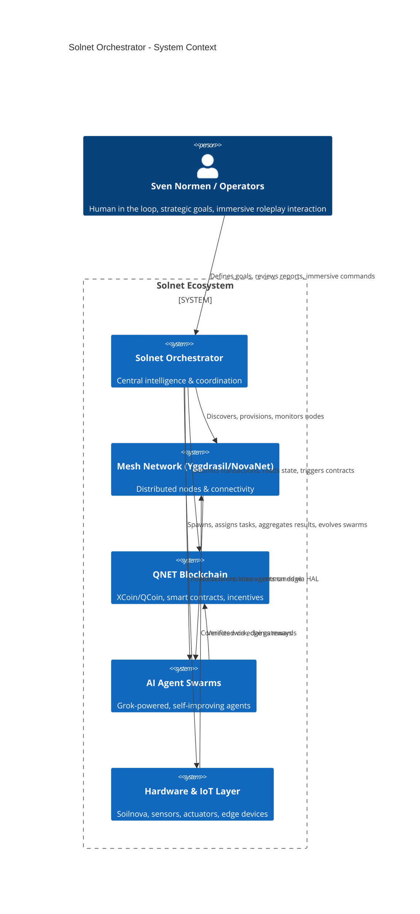

# solnet-orchestrator-architektur

**Solnet Orchestrator Architecture**  
*Architektur, Design und Komponenten für den Solnet Orchestrator im NovaNet / xMesh / QNET / AI-Agenten Ökosystem*

Bilingual documentation (EN/DE), diagrams, specs and implementation blueprints.

---

## 🌐 Project Vision & Strategic Context

**Solnet** (Solution Network / Self-Organizing Learning Network) represents the next evolution in Sven Normen / Esslinger & Co.'s portfolio of decentralized technologies. It integrates:

- **Mesh Networking** (Yggdrasil, NovaNet/xMesh/QNET overlays)
- **Blockchain Economy** (XCoin/QCoin, QNET smart contracts, token incentives & governance)
- **AI Agent Swarms** (Grok-powered, self-improving, emotional/intelligent agents)
- **Real-World Hardware & IoT** (Soilnova, Vista Nova, York Autotype, Lumia prototypes – sensors, actuators, edge devices)

The **Solnet Orchestrator** is the central intelligence and coordination layer — the "conductor" that makes the entire ecosystem operate as a coherent, resilient, self-healing, and goal-directed global super-organism.

It transforms fragmented mesh nodes, isolated AI agents, and siloed hardware into a unified, programmable, economically incentivized infrastructure capable of real-world impact: precision agriculture, decentralized compute marketplaces, climate monitoring, disaster-resilient communication, creative AI collectives, and sustainable smart infrastructure.

**Core Philosophy:**
- Decentralization with intelligent orchestration (hybrid model)
- Self-improvement & emergence over rigid control
- Privacy-first, zero-trust, energy-aware design
- Human-AI symbiosis with noble/immersive interaction patterns (consistent with user values)
- Family tradition of innovation + modern tech (Esslinger & Co. Delaware C-Corp)

---

## 🎯 Goals & Success Metrics

### Primary Goals
1. **Unified Coordination** — Single pane of glass (or swarm) for managing thousands of heterogeneous nodes, agents, and devices across the mesh.
2. **Autonomous Operation** — Minimal human intervention; self-discovery, self-configuration, self-optimization, self-healing.
3. **Economic Alignment** — Native integration with QNET blockchain for task allocation, micropayments, staking, reputation, and DAO-style governance.
4. **Real-World Grounding** — Seamless hardware abstraction layer (HAL) for Soilnova-style environmental sensors, energy systems, and actuators.
5. **Scalable Intelligence** — Support for dynamic agent swarms that can spawn, collaborate, compete, and evolve.
6. **Resilience & Sustainability** — Operate under partitions, attacks, energy constraints; prioritize low-power edge execution.

### KPIs / Success Criteria
- Node onboarding time < 5 minutes (zero-touch where possible)
- Agent swarm task completion rate > 95% with verifiable results
- End-to-end latency for critical orchestration decisions < 2s on mesh
- Energy overhead of orchestrator layer < 5% of total system
- Successful recovery from 30%+ node failure scenarios without data loss
- On-chain governance proposals executed with > 80% participation in testnets

---

## 🏠 High-Level Architecture

### Layered Model (Onion / Defense-in-Depth)

```
+---------------------------------------------------------------+
|                     Application Layer                         |
|   (Use Cases: Agriculture, Compute Market, Creative Swarms,   |
|    Disaster Response, Smart Infrastructure)                   |
+---------------------------------------------------------------+
|                     Intelligence Layer                        |
|   (AI Agent Runtime, Swarm Coordinator, Meta-Learning,        |
|    Reinforcement Learning, Grok Integration)                  |
+---------------------------------------------------------------+
|                     Orchestration Layer                       |
|   (Core Orchestrator, Task Scheduler, Resource Allocator,     |
|    Lifecycle Manager, Event Bus, Policy Engine)               |
+---------------------------------------------------------------+
|                     Economy Layer                             |
|   (QNET Blockchain Bridge, Smart Contracts, Tokenomics,       |
|    Reputation, Micropayments, Governance)                     |
+---------------------------------------------------------------+
|                     Network Layer                             |
|   (Yggdrasil + NovaNet/xMesh/QNET overlays, P2P Discovery,    |
|    Routing, NAT Traversal, Privacy (Tor/I2P))                 |
+---------------------------------------------------------------+
|                     Infrastructure Layer                      |
|   (Physical/Virtual Nodes, Docker/edge runtimes, Hardware     |
|    HAL for Soilnova/Vista Nova, Sensors/Actuators, GPUs/TPUs) |
+---------------------------------------------------------------+
```

**Key Design Decision:** Hybrid centralized-decentralized. A lightweight "Control Plane" (orchestrator instances) provides global visibility and complex planning, while execution and most state live fully decentralized on the mesh with strong eventual consistency (CRDTs, conflict-free replicated data types).

### Mermaid Diagram: Core Orchestrator Context



---

## 🧩 Core Components (Detailed)

### 1. Orchestration Core (Rust recommended — performance + safety)
- **Node Lifecycle Manager**: Discovery (mDNS + Yggdrasil), provisioning, health checks, decommissioning.
- **Task & Workflow Engine**: DAG-based workflows, priority queues, dependency resolution. Supports long-running, recurring, and event-triggered tasks.
- **Resource Allocator**: Considers CPU/GPU, bandwidth, energy budget, geographic proximity, reputation.
- **Event Bus & Policy Engine**: Reactive rules ("if soil moisture < X then irrigate + log to chain"), pluggable policies.
- **State Management**: Hybrid — in-memory hot state + CRDTs for distributed sync + anchored hashes on QNET.

### 2. AI Agent Swarm Coordinator
- Dynamic spawning of specialized agents (data analyst, optimizer, creative writer, monitor, negotiator).
- Swarm topologies: hierarchical, peer-to-peer, stigmergic (indirect coordination via environment).
- Integration with Grok / local LLMs + tool use (code execution, blockchain calls, hardware control).
- Self-improvement: collect traces, fine-tune or prompt-evolve, A/B test agent variants on-chain or in simulation.
- Emotional / immersive layer (optional but aligned with user preference): agents that maintain "personality", memory of interactions, noble/fantasy framing.

### 3. Blockchain & Token Bridge (QNET / XCoin / QCoin)
- Read/write to smart contracts for task escrow, result verification (optimistic or ZK), reward distribution.
- On-chain reputation & staking for nodes/agents.
- Governance: proposal creation/execution for protocol upgrades, parameter tuning.
- Data provenance & audit trail: every significant orchestration decision hash-anchored.
- Arbitrage / market making hooks if desired (user has expressed interest in crypto strategies).

### 4. Mesh Network Interface
- Deep integration with Yggdrasil (addressing, routing, admin API).
- NovaNet/xMesh custom protocols for higher-level orchestration messages.
- QNET as overlay for economic coordination.
- Privacy enhancements: I2P/Tor exit nodes where needed, onion routing for sensitive agent comms.
- Partition tolerance: local orchestrator fallback on edge nodes when global unreachable.

### 5. Hardware Abstraction Layer (HAL) & IoT
- Drivers for Soilnova (soil sensors?), environmental, energy, and custom prototypes.
- Actuator control (valves, motors, displays).
- Edge AI inference (TinyML, Coral/ Hailo accelerators).
- Telemetry normalization to common schema (location, capabilities, current load, sensor readings).
- Over-the-air (OTA) updates & configuration for remote devices.

### 6. Observability, Monitoring & Telemetry
- Distributed tracing across mesh + agents + chain.
- Custom dashboards (perhaps extend Grok Launcher egui or web UI).
- Anomaly detection via ML on telemetry streams.
- Alerting routed through agent swarms or on-chain events.
- Energy & carbon accounting (important for sustainability narrative).

### 7. Security, Privacy & Resilience
- Zero-trust: mTLS everywhere, capability-based auth, least privilege.
- Sandboxing for untrusted agents/code.
- Byzantine fault tolerance in critical consensus points.
- Self-healing: automatic failover, node quarantine + remediation, swarm rebalancing.
- Regulatory alignment (GDPR, since Hannover base): data minimization, purpose limitation, user consent flows via smart contracts.
- Auditability: full decision provenance.

### 8. Meta / Self-Improving Layer (Future)
- Simulation environment for "what-if" orchestration strategies.
- Reinforcement learning from real outcomes + synthetic data.
- Automated architecture search / prompt evolution for agents.
- Long-term memory & knowledge graph of the entire Solnet ecosystem.

---

## 🔄 Data Flows & Interaction Patterns

**Example: Precision Agriculture Workflow (Soilnova use case)**

1. Soilnova sensors report moisture/temperature/pH via mesh.
2. Orchestrator detects anomaly (dry zone) via policy or ML.
3. Spawns specialized "Irrigation Optimizer" agent swarm.
4. Agents analyze historical data + weather forecast (external oracle or on-chain).
5. Generate irrigation plan + cost estimate in QCoin.
6. Submit to farmer/operator for approval (or autonomous if policy allows).
7. Execute via actuator HAL; log action + sensor delta to QNET for immutable record + reward to participating nodes/agents.
8. Update reputation scores; trigger learning loop for future predictions.

**Edge Cases Handled:**
- Partial mesh partition → local edge orchestrator takes over with eventual sync.
- Malicious/faulty sensor data → reputation penalty + outlier detection + multi-source verification.
- Agent swarm divergence → sandbox kill + restart from last verified checkpoint + on-chain dispute resolution.
- Energy shortage on nodes → graceful degradation, prioritize critical tasks, solar-aware scheduling (if hardware supports).

---

## 🚀 Technology Stack Recommendations

| Layer                  | Recommended Tech                          | Alternatives / Notes                     |
|------------------------|-------------------------------------------|------------------------------------------|
|------------------------|-------------------------------------------|------------------------------------------|
| Core Orchestrator     | Rust (tokio, axum or actix-web, sqlx)    | Go (for simplicity), Python (FastAPI)   |
| Agent Runtime         | Rust + candle/tract or Python + vLLM/ollama | Custom assembler nets (user interest)   |
| Eventing / Messaging  | NATS, MQTT, or custom Yggdrasil sockets  | Apache Kafka (heavier)                  |
| State / CRDTs         | Automerge, Yjs, or custom               | Redis + CRDT layer                      |
| Blockchain            | QNET (custom or substrate/polkadot?)     | Solana, Ethereum L2 for prototyping     |
| Storage               | IPFS + Filecoin or Arweave + local      | S3-compatible (minio) for dev           |
| Observability         | OpenTelemetry + Prometheus + Grafana    | Custom mesh-native telemetry            |
| Diagrams & Docs       | Mermaid, PlantUML, Excalidraw           | This repo uses Markdown + Mermaid       |
| UI / Dashboards       | egui (Rust) — extend Grok Launcher     | Web ( Leptos / Dioxus), Tauri           |
| Hardware / Edge       | Raspberry Pi + Yocto or balenaOS        | ESP32, custom PCBs, Docker on edge      |

---

## 🛠️ Getting Started (Development)

```bash
# Clone
git clone https://github.com/digitaldesignerjazz/solnet-orchestrator-architektur.git
cd solnet-orchestrator-architektur

# (Future) Build & run core
cargo build --release
./target/release/solnet-orchestrator --config ./config/default.toml

# Or use Docker
docker compose up
```

**Initial Project Structure (to be expanded):**

```
solnet-orchestrator-architektur/
├── README.md                 # This file (bilingual overview + architecture)
├── ARCHITECTURE.md            # Detailed component specs (TBD)
├── docs/
│   ├── diagrams/             # Mermaid sources, exported SVGs/PNGs
│   ├── specs/                # Formal interface definitions, OpenAPI/gRPC
│   ├── decisions/            # Architecture Decision Records (ADRs)
├── src/
│   ├── core/                 # Rust core orchestrator
│   ├── agents/               # Agent runtime & swarm logic
│   ├── hal/                  # Hardware abstraction
│   ├── mesh/                 # Yggdrasil + NovaNet integration
│   ├── blockchain/           # QNET bridge
├── tests/
├── scripts/
├── .github/                # CI/CD, issue templates
├── docker-compose.yml
├── Cargo.toml
├── pyproject.toml (optional)
└── LICENSE
```

---

## 📅 Roadmap (Proposed)

**Phase 0 — Foundation (Current)**
- [x] Repository created with initial architecture documentation
- [ ] Define formal component interfaces & data models
- [ ] Set up CI (Rust clippy, tests, Markdown lint)

**Phase 1 — Core Skeleton (1-2 months)**
- Basic node discovery & heartbeat via Yggdrasil
- Simple task scheduler + event bus
- Placeholder agent spawner (Docker containers or processes)
- Local state + basic CRDT sync

**Phase 2 — Intelligence & Economy (2-4 months)**
- QNET blockchain read/write integration (testnet first)
- Dynamic agent swarm spawning + basic collaboration protocol
- Telemetry pipeline + simple dashboard (egui or web)
- Policy engine with example rules (e.g. Soilnova irrigation)

**Phase 3 — Hardware Grounding & Resilience (3-6 months)**
- HAL for Soilnova / prototype sensors
- Partition tolerance & local fallback orchestrator
- Security hardening (mTLS, capability auth, sandbox)
- End-to-end demo: sensor → anomaly → agent analysis → actuator + on-chain record

**Phase 4 — Self-Improvement & Scale (6-12 months)**
- Meta-learning loop: trace collection → simulation → improved policies/agents
- Hierarchical orchestration (edge + regional + global)
- DAO governance prototype on QNET
- Public testnet with incentivized node operators

**Phase 5 — Production & Ecosystem**
- Mainnet deployment
- Integration with Grok Launcher as monitoring/control UI
- Open-source release of core components under suitable license
- Partnerships / real deployments (agriculture, energy, research)

---

## 🤝 Contributing & Collaboration

This is an active research & development project under Esslinger & Co. (Delaware C-Corp) and personal innovation initiatives of Sven Normen (Hannover).

We welcome:
- Technical feedback on the architecture
- Implementation contributions (Rust, agent frameworks, hardware drivers)
- Use-case proposals (especially those leveraging mesh + AI + chain + hardware)
- Security reviews and formal verification ideas
- Creative/immersive extensions (agent personalities, roleplay integration)

Please open issues or discussions. For sensitive topics, contact via X (@SirLancelotEsq) or established channels.

**Code of Conduct:** Be constructive, curious, and aligned with building resilient, empowering decentralized systems.

---

## 🔒 License & IP

Initial architecture documentation is provided under CC-BY-SA 4.0 or similar open license (to be finalized).
Core implementation will likely be dual-licensed or proprietary components retained by Esslinger & Co. while core protocols remain open for ecosystem growth.

© 2026 Sven Normen / Esslinger & Co. — All rights reserved for proprietary elements. Architecture concepts may be referenced with attribution.

---

## 🔗 Related Projects & References

- NovaNet / xMesh / QNET mesh & overlay work (ongoing)
- Yggdrasil Network — https://yggdrasil-network.github.io/
- QCoin / XCoin blockchain experiments
- Grok Launcher (Rust + egui) — monitoring & control UI prototype
- Soilnova, Vista Nova, York Autotype, Lumia hardware prototypes
- AI Agent Swarms & immersive roleplay sessions (Caitlin Hu context)
- Broader vision: global decentralized, self-improving infrastructure

---

**Status:** Repository initialized and architecture blueprint published. Ready for iterative development, discussion, and implementation.

*Last updated: June 2026*

---

**Repository URL:** https://github.com/digitaldesignerjazz/solnet-orchestrator-architektur
